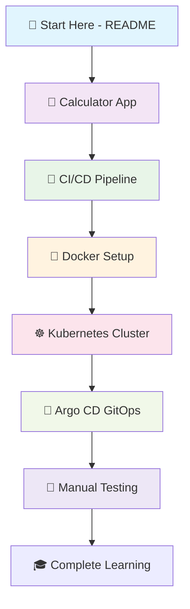

# 🚀 DevOps Learning Journey - Complete Stack Implementation

## 🎯 **Welcome to Your DevOps Study Repository**

This repository demonstrates a **complete DevOps implementation** using modern tools and best practices. You'll learn by doing - from basic application deployment to advanced GitOps automation.

### **What You'll Learn**

✅ **Node.js Application** - Simple calculator web app
✅ **CI/CD Pipeline** - GitHub Actions automation
✅ **Docker Containerization** - Multi-stage production builds
✅ **Kubernetes Orchestration** - Local cluster with KinD
✅ **Argo CD GitOps** - Automated deployments from Git
✅ **Manual Testing** - Comprehensive validation scenarios

---

## 📋 **Learning Path Overview**



---

## 🧮 **Phase 1: The Calculator Application**

### **What is this project?**

This is a **simple calculator web application** built with HTML, CSS, and JavaScript that runs on Node.js. It's the perfect starting point for learning DevOps because:

- 🎯 **Simple to understand** - Basic web application
- 🧪 **Easy to test** - Clear functionality to validate
- 🔧 **Modular design** - Easy to modify and extend
- 📦 **Production ready** - Demonstrates real-world patterns

### **Try the Application**

```bash
# 1. Start the application locally
node server.js

# 2. Open browser to:
open http://localhost:3000

# 3. Test calculator functionality:
#    - Click number buttons (1, 2, 3...)
#    - Click operations (+, -, ×, ÷)
#    - Click equals (=) to calculate
#    - Click clear (C) to reset
```

### **Application Features**
- ➕ **Basic arithmetic** - Addition, subtraction, multiplication, division
- 🔢 **Decimal support** - Floating point calculations
- 🧹 **Clear function** - Reset calculator state
- 📱 **Responsive design** - Works on mobile and desktop
- ⚡ **Fast performance** - Lightweight and optimized

---

## 🔧 **Phase 2: CI/CD Pipeline Implementation**

Now that you understand the application, let's implement **continuous integration and deployment**.

### **What is CI/CD?**
CI/CD (Continuous Integration/Continuous Deployment) automates the process of building, testing, and deploying applications. Every code change triggers automated validation and deployment.

### **Your Pipeline Features**

```bash
# View the complete CI/CD pipeline
cat .github/workflows/ci.yml
```

**What the pipeline does:**
- ✅ **Multi-Node Testing** - Tests on Node.js 18.x and 20.x
- ✅ **Application Validation** - Verifies server starts and responds
- ✅ **Content Testing** - Ensures calculator HTML is served
- ✅ **Syntax Checking** - Validates JavaScript and HTML
- ✅ **Error Detection** - Catches issues before deployment

### **Pipeline Execution**
```bash
# The pipeline runs automatically on:
# - Every push to main/master/develop branches
# - Every pull request to main/master/develop branches

# Check pipeline status in GitHub Actions tab
# or run tests locally
```

**🔗 [Read Complete CI/CD Implementation Guide →](.github/workflows/ci.yml)**

---

*[← Back to Learning Path](#-learning-path-overview)*

---

## 🐳 **Phase 3: Docker Containerization**

### **Why Containerization?**

Containers package applications with their dependencies, ensuring consistent behavior across different environments. Your calculator becomes portable and deployment-ready.

### **Your Docker Implementation**

```bash
# View Docker setup guide
cat docs/DOCKER_ORGANIZATION.md
```

**What you'll learn:**
- 🏗️ **Multi-stage builds** - Optimized production images (~50MB vs ~200MB)
- 🔒 **Security hardening** - Non-root user, minimal attack surface
- ⚡ **Performance optimization** - Layer caching, build efficiency
- 📦 **Container orchestration** - Ready for Kubernetes deployment

### **Docker Commands to Try**
```bash
# Build optimized image
docker build -f docker/Dockerfile -t simple-calculator:latest .

# Run containerized application
docker run -d -p 3000:3000 --name calculator-app simple-calculator:latest

# Test container functionality
curl http://localhost:3000

# View container logs
docker logs calculator-app

# Clean up
docker stop calculator-app && docker rm calculator-app
```

**🔗 [Read Complete Docker Implementation Guide →](docs/DOCKER_ORGANIZATION.md)**

---

*[← Back to Learning Path](#-learning-path-overview)*

---

## ☸️ **Phase 4: Kubernetes Orchestration**

### **Why Kubernetes?**

Kubernetes automates deployment, scaling, and management of containerized applications. It provides the foundation for production-ready deployments.

### **Your Kubernetes Setup**

```bash
# View Kubernetes setup guide
cat docs/KUBERNETES_GUIDE.md
```

**What you'll learn:**
- 🚀 **Deployment management** - Pod lifecycle and scaling
- 🌐 **Service networking** - Load balancing and service discovery
- 💚 **Health monitoring** - Liveness and readiness probes
- 📊 **Resource management** - CPU and memory allocation
- 🔧 **Rolling updates** - Zero-downtime deployments

### **Kubernetes Commands to Try**
```bash
# Create local cluster (if not exists)
kind create cluster --name kind

# Deploy application
kubectl apply -f k8s/deployment.yaml
kubectl apply -f k8s/service.yaml

# Scale application
kubectl scale deployment simple-calculator --replicas=3

# Access application
kubectl port-forward service/simple-calculator-service 8080:80
open http://localhost:8080

# Monitor deployment
kubectl get pods -l app=simple-calculator -w
```

**🔗 [Read Complete Kubernetes Implementation Guide →](docs/KUBERNETES_GUIDE.md)**

---

*[← Back to Learning Path](#-learning-path-overview)*

---

## 🔄 **Phase 5: Argo CD GitOps Automation**

### **What is GitOps?**

GitOps uses Git as the single source of truth for infrastructure and applications. Every change goes through Git workflows, enabling better collaboration and audit trails.

### **Your Argo CD Implementation**

```bash
# View GitOps setup guide
cat docs/ARGOCD_GUIDE.md
```

**What you'll learn:**
- 🔄 **Automated deployments** - Changes sync automatically from Git
- ⏪ **Rollback capability** - Instant revert to previous versions
- 🔧 **Self-healing** - Automatic drift correction
- 📊 **Observability** - Complete sync and health monitoring
- 🔒 **Security** - RBAC and approval workflows

### **Argo CD Commands to Try**
```bash
# Access Argo CD dashboard
kubectl port-forward svc/argocd-server -n argocd 8082:443
open https://localhost:8082

# Check application status
kubectl argo app get simple-calculator

# View managed resources
kubectl argo app get simple-calculator -o tree

# Make a change and watch auto-sync
vim k8s/deployment.yaml
# Change replica count, save, commit, push
git add k8s/deployment.yaml && git commit -m "Test auto-sync" && git push
```

**🔗 [Read Complete Argo CD Implementation Guide →](docs/ARGOCD_GUIDE.md)**

---

*[← Back to Learning Path](#-learning-path-overview)*

---

## 🧪 **Phase 6: Manual Testing & Validation**

### **Test Your Complete DevOps Stack**

Now that everything is deployed, let's validate that your entire DevOps implementation works correctly.

### **Testing Categories**

```bash
# View testing guides
ls testing/
# ARGOCD_MANUAL_TESTS.md    CI_PIPELINE_MANUAL_TESTS.md
```

**📋 Testing Scenarios Available:**

#### **🔄 Argo CD GitOps Tests**
- 🔐 **Access Control Test** - Dashboard security validation
- 📊 **Monitoring & Observability Test** - Application status monitoring
- 🔬 **End-to-End Application Test** - Complete functionality validation
- ⏪ **Rollback Test** - Version rollback capability
- 🔧 **Self-Healing Test** - Automatic drift correction
- 🚀 **Update Application Version** - Rolling update testing
- 📊 **Scale Application** - Horizontal scaling validation

#### **🔧 CI/CD Pipeline Tests**
- 🎨 **Color Palette Test** - UI customization changes
- 🔤 **Text Content Test** - Content modification testing
- 🧮 **Calculator Functionality Test** - Mathematical operations
- 🚀 **Performance Test** - Response times and load handling
- 🔒 **Security Headers Test** - Security implementation
- 🌐 **Cross-Browser Compatibility Test** - Multi-browser support
- 🔄 **GitOps Integration Test** - Complete CI/CD + Argo CD workflow

### **Running Tests**

```bash
# View Argo CD tests
cat testing/ARGOCD_MANUAL_TESTS.md

# View CI Pipeline tests
cat testing/CI_PIPELINE_MANUAL_TESTS.md

# Follow step-by-step instructions in each file
# Run commands manually to validate each component
```

**🔗 [Start Manual Testing →](#-testing-categories)**

---

*[← Back to Learning Path](#-learning-path-overview)*

---

## 🎓 **What You've Learned**

### **Complete DevOps Stack**
- ✅ **Application Development** - Node.js web application
- ✅ **CI/CD Automation** - GitHub Actions pipeline
- ✅ **Containerization** - Docker multi-stage builds
- ✅ **Orchestration** - Kubernetes deployment and scaling
- ✅ **GitOps** - Argo CD automated deployments
- ✅ **Testing** - Manual validation scenarios

### **Key DevOps Concepts**
- 🔄 **Continuous Integration** - Automated testing and validation
- 🚀 **Continuous Deployment** - Automated application delivery
- 📦 **Containerization** - Application packaging and portability
- ☸️ **Orchestration** - Container lifecycle management
- 🔄 **GitOps** - Infrastructure as code with Git workflows
- 🧪 **Observability** - Monitoring, logging, and troubleshooting

### **Production-Ready Features**
- 🔒 **Security hardening** - Non-root containers, minimal images
- 📊 **Monitoring** - Health checks, resource management
- 🔧 **Self-healing** - Automatic failure recovery
- ⏪ **Rollback** - Instant version reversion
- 📈 **Scalability** - Horizontal scaling capabilities

---

## 🚀 **Next Steps & Advanced Learning**

### **Extend Your Learning**
1. **🔧 Customize the application** - Add new calculator features
2. **📊 Add monitoring** - Prometheus, Grafana integration
3. **🔒 Enhance security** - Secrets management, network policies
4. **🌐 Multi-environment** - Staging and production setups
5. **📈 Advanced scaling** - HPA, VPA, cluster autoscaling

### **Real-World Applications**
- 🏭 **Microservices** - Break calculator into multiple services
- 🌍 **Multi-region** - Deploy across different regions
- 📊 **Observability** - Add comprehensive monitoring
- 🔒 **Security** - Implement pod security policies
- 💰 **Cost optimization** - Right-size resources

### **Community & Resources**
- 📖 **Kubernetes Documentation** - [kubernetes.io/docs](https://kubernetes.io/docs)
- 🔄 **Argo CD Documentation** - [argo-cd.readthedocs.io](https://argo-cd.readthedocs.io)
- 🐳 **Docker Documentation** - [docs.docker.com](https://docs.docker.com)
- 🔧 **GitHub Actions** - [docs.github.com/actions](https://docs.github.com/actions)

---

## 🎉 **Congratulations!**

You've successfully implemented and learned a **complete DevOps stack** from basic application deployment to advanced GitOps automation. This repository serves as both a working application and a comprehensive learning resource.

**🌟 Key Achievement:** You now understand how modern DevOps practices work together to deliver reliable, scalable applications in production environments.

**🚀 Ready to apply these concepts to your own projects!**

---

## 📞 **Support & Questions**

If you encounter issues or have questions:

1. **Check the troubleshooting sections** in each guide
2. **Review the manual testing scenarios** for validation
3. **Examine the application logs** for debugging information
4. **Use the verification checklists** to ensure proper setup

**Happy Learning! 🎓**
