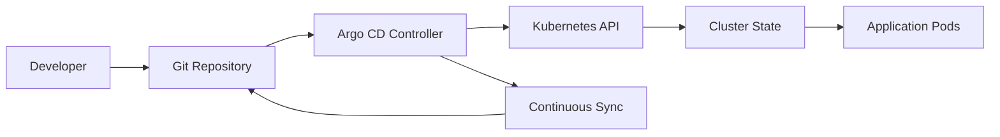
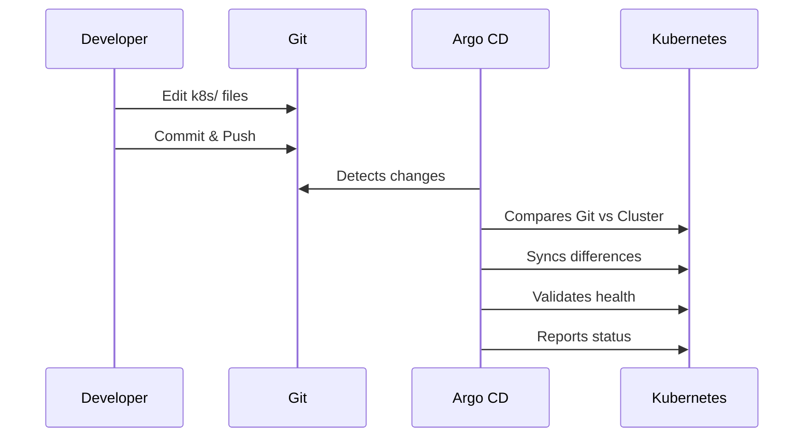

# 🔄 Argo CD GitOps Implementation Guide - Complete Tutorial

## 🎯 **Understanding GitOps & Argo CD**

### **What is GitOps?**
GitOps is a **continuous delivery model** for cloud-native applications that uses Git as the single source of truth for declarative infrastructure and applications. All changes go through Git workflows, enabling better collaboration, audit trails, and disaster recovery.

### **What is Argo CD?**
Argo CD is a **declarative GitOps continuous delivery tool** for Kubernetes that follows the GitOps pattern of using Git repositories as the source of truth for defining the desired application state.

### **How GitOps Works**


**GitOps Principles:**
- **🎯 Declarative** - Everything defined in Git
- **🔄 Version Controlled** - Full history and rollback
- **🤝 Collaboration** - Pull requests and code reviews
- **🔍 Observable** - Changes tracked and auditable
- **🔧 Automated** - Self-healing and auto-sync

### **Why GitOps Helps Your Calculator Project**

#### **🚀 Deployment Benefits**
- **🔄 Automated Deployments** - Changes auto-sync from Git to cluster
- **📋 Declarative Configuration** - Define desired state in YAML
- **🔧 Zero-Downtime Updates** - Rolling updates with health checks
- **📊 Environment Consistency** - Same config across dev/staging/prod

#### **⚙️ Management Benefits**
- **🔍 Visibility** - See all changes in Git history
- **🔒 Security** - RBAC and approval workflows
- **🔧 Debugging** - Easy rollback to previous versions
- **📈 Scalability** - Manage multiple environments easily

#### **🏗️ Architecture Benefits**
- **🏭 Infrastructure as Code** - Everything version controlled
- **🌍 Multi-Environment** - Consistent deployments everywhere
- **🔧 DevOps Integration** - Works with existing CI/CD
- **📊 Compliance** - Audit trails and change tracking

---

## 📁 **Argo CD File Organization**

### **Project Structure**
```
/Users/parasana/Downloads/CascadeProjects/windsurf-project/
├── argocd/                       # 🔄 GitOps Configuration
│   └── application.yaml          # Argo CD application definition
├── k8s/                         # ☸️ Kubernetes manifests
├── .github/                     # 🔧 CI/CD pipeline
├── docs/                        # 📚 Documentation
└── [application files...]
```

---

## 🔄 **Argo CD Application Deep Dive**

### **What Each Section Does**

#### **📋 Application Configuration (`argocd/application.yaml`)**
```yaml
apiVersion: argoproj.io/v1alpha1    # 🔧 Argo CD API version
kind: Application                   # 🎯 Argo CD resource type
metadata:
  name: simple-calculator           # 🏷️ Application name
  namespace: argocd                 # 📍 Argo CD namespace
  labels:
    app: simple-calculator          # 🏷️ Application labels
spec:
  project: default                  # 📁 Argo CD project
  source:                           # 📚 Git repository source
    repoURL: https://github.com/Chaitanya299/DevOps-calci.git
    targetRevision: HEAD            # 🔄 Branch/tag/commit
    path: k8s                       # 📁 Path in repository
  destination:                      # 🎯 Target cluster
    server: https://kubernetes.default.svc
    namespace: default              # 📍 Target namespace
  syncPolicy:                       # 🔄 Sync configuration
    automated:
      prune: true                   # 🗑️ Remove deleted resources
      selfHeal: true                # 🔧 Auto-fix drift
    syncOptions:
      - CreateNamespace=true         # 📁 Create namespace if needed
```

### **Sync Policies Explained**

#### **Automated Sync** (Current Configuration)
```yaml
syncPolicy:
  automated:
    prune: true      # 🗑️ Remove resources not in Git
    selfHeal: true   # 🔧 Auto-sync if cluster drifts
```
- **🔄 Automatic**: Changes sync without manual intervention
- **🗑️ Prune**: Removes resources deleted from Git
- **🔧 Self-Heal**: Fixes cluster drift automatically

#### **Manual Sync** (Alternative)
```yaml
syncPolicy:
  manual:
    prune: true
    selfHeal: false
# Requires manual sync button clicks
```

### **Source Configuration Explained**

| Field | Purpose | Your Setting |
|-------|---------|--------------|
| **`repoURL`** | Git repository location | `https://github.com/Chaitanya299/DevOps-calci.git` |
| **`targetRevision`** | Branch/tag to track | `HEAD` (latest commit) |
| **`path`** | Folder to watch | `k8s` (Kubernetes manifests) |

### **Destination Configuration Explained**

| Field | Purpose | Your Setting |
|-------|---------|--------------|
| **`server`** | Kubernetes API server | `https://kubernetes.default.svc` (KinD) |
| **`namespace`** | Target namespace | `default` |

---

## 🔧 **Setup Instructions**

### **Prerequisites**
```bash
# Argo CD requires Kubernetes cluster
# Use KinD for local development
kind create cluster --name kind

# Install kubectl
curl -LO "https://dl.k8s.io/release/$(curl -L -s https://dl.k8s.io/release/stable.txt)/bin/linux/amd64/kubectl"
chmod +x kubectl
sudo mv kubectl /usr/local/bin/
```

### **Argo CD Installation**
```bash
# 1. Create Argo CD namespace
kubectl create namespace argocd

# 2. Install Argo CD
kubectl apply -n argocd -f https://raw.githubusercontent.com/argoproj/argo-cd/stable/manifests/install.yaml

# 3. Wait for pods to be ready
kubectl wait --for=condition=available --timeout=300s deployment/argocd-server -n argocd

# 4. Get initial admin password
kubectl get secret argocd-initial-admin-secret -n argocd -o jsonpath="{.data.password}" | base64 -d
```

### **Access Argo CD Dashboard**
```bash
# Port-forward Argo CD server
kubectl port-forward svc/argocd-server -n argocd 8082:443

# Access dashboard
open https://localhost:8082

# Login credentials
# Username: admin
# Password: <from kubectl get secret command>
```

### **Create Your Application**
```bash
# Apply Argo CD application manifest
kubectl apply -f argocd/application.yaml

# Verify application is created
kubectl get applications -n argocd

# Check sync status
kubectl argo app get simple-calculator
```

---

## 🎯 **Integration with DevOps Stack**

### **🔗 Kubernetes Integration**
```bash
# Argo CD manages Kubernetes resources
kubectl get applications -n argocd
# NAME               SYNC STATUS   HEALTH STATUS
# simple-calculator  Synced        Healthy

# View managed resources
kubectl argo app get simple-calculator -o tree

# Check application details
kubectl argo app get simple-calculator -o yaml
```

### **🐳 Docker Integration**
```bash
# Argo CD syncs when k8s/ files change
# New Docker images trigger rolling updates
# Health checks ensure successful deployments
kubectl get pods -l app=simple-calculator
```

### **🔧 CI/CD Integration**
```yaml
# GitHub Actions can trigger Argo CD syncs
- name: Trigger Argo CD sync
  run: |
    kubectl argo app sync simple-calculator
    kubectl argo app wait simple-calculator --for=condition=healthy
```

---

## 🛠️ **Advanced Argo CD Features**

### **🔄 Sync Operations**
```bash
# Manual sync (if not automated)
kubectl argo app sync simple-calculator

# Sync with pruning (remove deleted resources)
kubectl argo app sync simple-calculator --prune

# Sync specific resources only
kubectl argo app sync simple-calculator --resource apps:Deployment/simple-calculator

# Force sync (skip validation)
kubectl argo app sync simple-calculator --force
```

### **📊 Application Monitoring**
```bash
# Get application status
kubectl argo app get simple-calculator

# Watch application status
kubectl argo app get simple-calculator -w

# View application logs
kubectl argo app logs simple-calculator

# Check application events
kubectl get events -n argocd --field-selector involvedObject.name=simple-calculator
```

### **🔍 Resource Management**
```bash
# View all resources managed by application
kubectl argo app get simple-calculator -o tree

# Get resource details
kubectl argo app get simple-calculator --resource apps:Deployment/simple-calculator

# View resource diff (Git vs cluster)
kubectl argo app diff simple-calculator

# Get resource health
kubectl argo app get simple-calculator --health
```

### **🔧 Application Updates**
```bash
# Update application source
kubectl argo app set simple-calculator --repo https://github.com/new/repo.git

# Update target revision
kubectl argo app set simple-calculator --revision feature-branch

# Update destination namespace
kubectl argo app set simple-calculator --dest-namespace production

# Apply changes
kubectl argo app sync simple-calculator
```

---

## 📈 **GitOps Workflow & Benefits**

### **Complete GitOps Workflow**


### **GitOps Benefits for Your Project**

#### **🔄 Automation Benefits**
- **Zero Manual Intervention** - Changes auto-deploy
- **Consistent Deployments** - Same process every time
- **Faster Releases** - Minutes instead of hours
- **Reduced Errors** - No manual configuration drift

#### **🔍 Visibility Benefits**
- **Complete Audit Trail** - Every change tracked in Git
- **Pull Request Reviews** - Code review for infrastructure
- **Rollback Capability** - Instant rollback to any version
- **Compliance Ready** - Meets regulatory requirements

#### **⚙️ Management Benefits**
- **Environment Parity** - Dev/staging/prod consistency
- **Team Collaboration** - Works with existing Git workflows
- **Disaster Recovery** - Recreate entire environment from Git
- **Security** - RBAC and approval processes

---

## 🚨 **Troubleshooting Guide**

### **Common Issues & Solutions**

#### **🔄 Application Not Syncing**
```bash
# Check application status
kubectl argo app get simple-calculator

# View application logs
kubectl argo app logs simple-calculator

# Check repository access
kubectl argo repo list

# Refresh repository
kubectl argo app refresh simple-calculator

# Force sync
kubectl argo app sync simple-calculator
```

#### **🌐 Cluster Connectivity Issues**
```bash
# Check cluster connection
kubectl cluster-info

# Verify Argo CD server status
kubectl get pods -n argocd

# Check server logs
kubectl logs -l app.kubernetes.io/name=argocd-server -n argocd

# Test Kubernetes API access
kubectl get nodes
```

#### **📦 Resource Issues**
```bash
# Check if resources exist in cluster
kubectl get deployment simple-calculator
kubectl get service simple-calculator-service

# Check resource status
kubectl describe deployment simple-calculator

# View pod events
kubectl get events --field-selector involvedObject.name=simple-calculator-abc123

# Check resource health
kubectl argo app get simple-calculator --health
```

#### **🔧 Sync Policy Issues**
```bash
# Check current sync policy
kubectl argo app get simple-calculator -o yaml | grep -A 10 syncPolicy

# Update sync policy if needed
kubectl patch application simple-calculator -n argocd --type merge -p '{"spec":{"syncPolicy":{"automated":{"prune":true,"selfHeal":true}}}}'

# Manual sync if automated isn't working
kubectl argo app sync simple-calculator --force
```

---

## 📋 **Complete Workflow Examples**

### **Development Workflow**
```bash
# 1. Make changes to k8s/ files
vim k8s/deployment.yaml
# Update image tag or replica count

# 2. Commit and push
git add k8s/
git commit -m "Update calculator to v2.0"
git push origin main

# 3. Monitor Argo CD sync
kubectl argo app get simple-calculator -w

# 4. Verify deployment
kubectl get pods -l app=simple-calculator
kubectl logs -l app=simple-calculator -f

# 5. Test application
kubectl port-forward service/simple-calculator-service 8080:80
curl http://localhost:8080
```

### **Rollback Workflow**
```bash
# 1. Check application history
kubectl argo app history simple-calculator

# 2. Rollback to previous version
kubectl argo app rollback simple-calculator <revision-number>

# 3. Monitor rollback
kubectl argo app get simple-calculator -w

# 4. Verify rollback success
kubectl get pods -l app=simple-calculator
```

### **Multi-Environment Workflow**
```bash
# 1. Create staging application
kubectl argo app create simple-calculator-staging \
  --repo https://github.com/Chaitanya299/DevOps-calci.git \
  --path k8s \
  --dest-server https://kubernetes.default.svc \
  --dest-namespace staging \
  --sync-policy automated

# 2. Promote to production
kubectl argo app create simple-calculator-production \
  --repo https://github.com/Chaitanya299/DevOps-calci.git \
  --path k8s \
  --dest-server https://prod-cluster.example.com \
  --dest-namespace production \
  --sync-policy automated
```

---

## 🎉 **Argo CD Implementation Benefits Summary**

### **🔧 For Development**
- **Faster deployments** - No manual kubectl commands
- **Consistent environments** - Git as single source of truth
- **Easy testing** - Quick environment setup/teardown
- **Team collaboration** - Git workflows for infrastructure

### **🚀 For Deployment**
- **Automated rollouts** - Zero-downtime updates
- **Self-healing** - Auto-recovery from failures
- **Rollback capability** - Instant revert to previous versions
- **Environment consistency** - Same config everywhere

### **☸️ For Production**
- **Compliance ready** - Full audit trails
- **Security** - RBAC and approval workflows
- **Scalability** - Manage multiple clusters/environments
- **Disaster recovery** - Recreate from Git repository

---

## 📚 **Files Purpose Summary**

| File | Purpose | Key Features |
|------|---------|--------------|
| **`application.yaml`** | Argo CD app definition | Git source, sync policies, destination |
| **`k8s/deployment.yaml`** | Watched by Argo CD | Auto-synced when changed |
| **`k8s/service.yaml`** | Watched by Argo CD | Auto-synced when changed |

---

## 🎯 **Next Steps**

1. **📖 Study the application manifest** - Understand GitOps configuration
2. **🏃 Test the GitOps workflow** - Make changes and watch auto-sync
3. **🔄 Explore advanced features** - Try ApplicationSets for multiple environments
4. **📊 Set up monitoring** - Configure alerts for sync failures

**🎉 Your calculator project demonstrates complete GitOps implementation with Argo CD - from development to production with full automation!**
