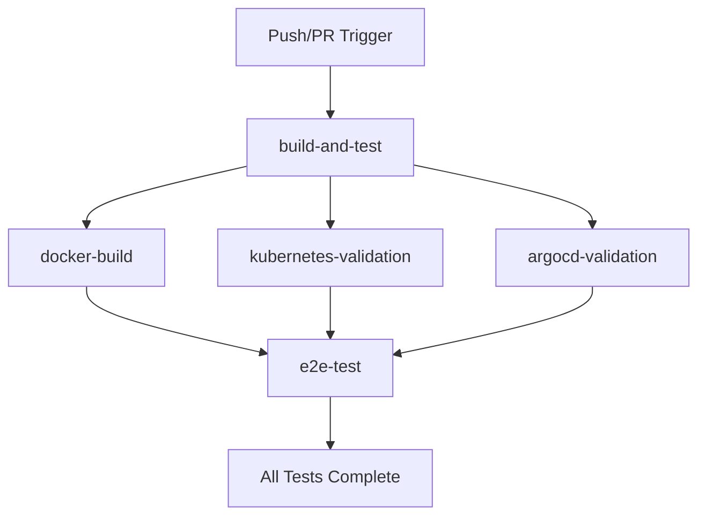

# Enhanced CI/CD Pipeline Guide

Complete guide for the enhanced GitHub Actions pipeline that tests Docker, Kubernetes, and Argo CD integration.

---

## 🚀 Pipeline Overview

The enhanced CI/CD pipeline now includes **5 comprehensive test jobs**:

### **Job 1: `build-and-test`** - Core Application Testing
- ✅ **Node.js compatibility** (18.x, 20.x)
- ✅ **Application startup** and HTTP response testing
- ✅ **HTML content validation**
- ✅ **JavaScript syntax checking**

### **Job 2: `docker-build`** - Container Testing
- ✅ **Docker image building** with multi-stage Dockerfile
- ✅ **Container runtime testing**
- ✅ **HTTP response validation** from container
- ✅ **Content verification** from Docker container

### **Job 3: `kubernetes-validation`** - Manifest Testing
- ✅ **Kubernetes YAML syntax** validation
- ✅ **Required field checking** (image references, kinds)
- ✅ **Manifest structure validation**

### **Job 4: `argocd-validation`** - GitOps Testing
- ✅ **Argo CD application** YAML validation
- ✅ **Repository and path** configuration checking
- ✅ **Sync policy validation**

### **Job 5: `e2e-test`** - End-to-End Testing
- ✅ **KinD cluster creation** and management
- ✅ **Docker image loading** into cluster
- ✅ **Kubernetes deployment** testing
- ✅ **Full application testing** through K8s service
- ✅ **Cleanup** of test resources

---

## 📊 Pipeline Flow



**Parallel Execution:** `docker-build`, `kubernetes-validation`, `argocd-validation` run in parallel after `build-and-test`  
**Final E2E:** `e2e-test` runs last and tests the complete stack

---

## 🛠️ Technologies Tested

| Technology | Test Coverage | Job |
|------------|---------------|-----|
| **Node.js** | Syntax, HTTP response, content | `build-and-test` |
| **Docker** | Build, runtime, networking | `docker-build` |
| **Kubernetes** | YAML validation, structure | `kubernetes-validation` |
| **Argo CD** | Configuration, GitOps setup | `argocd-validation` |
| **KinD** | Cluster creation, deployment | `e2e-test` |

---

## 📋 What Each Job Validates

### **1. Application Core (`build-and-test`)**
```bash
✅ server.js exists and has valid syntax
✅ index.html exists and contains required elements
✅ package.json is valid JSON
✅ Application starts and responds on port 3000
✅ HTML content is served correctly
✅ Multi-Node.js version compatibility (18.x, 20.x)
```

### **2. Docker Integration (`docker-build`)**
```bash
✅ Dockerfile builds successfully
✅ Multi-stage build creates optimized image
✅ Container starts and runs application
✅ Container networking works correctly
✅ Application accessible from container
✅ Content served correctly from container
```

### **3. Kubernetes Manifests (`kubernetes-validation`)**
```bash
✅ k8s/deployment.yaml exists and is valid YAML
✅ k8s/service.yaml exists and is valid YAML
✅ Deployment has correct kind and image reference
✅ Required fields are present
✅ Manifest structure is correct
```

### **4. Argo CD Configuration (`argocd-validation`)**
```bash
✅ argocd/application.yaml exists and is valid YAML
✅ Repository URL is configured correctly
✅ Path points to k8s/ folder
✅ Sync policy is properly configured
✅ All required Argo CD fields present
```

### **5. End-to-End Testing (`e2e-test`)**
```bash
✅ KinD cluster creation and configuration
✅ Docker image building and loading
✅ Kubernetes deployment and service creation
✅ Application accessibility through K8s service
✅ Full content validation through cluster
✅ Resource cleanup after testing
```

---

## 🚨 Failure Scenarios & Debugging

### **Application Test Failures**
```bash
# Check JavaScript syntax
node -c server.js

# Test server startup
node server.js &
curl http://localhost:3000

# Check HTML content
curl -s http://localhost:3000 | grep -q "Calculator"
```

### **Docker Test Failures**
```bash
# Check Docker build
docker build -f docker/Dockerfile -t test .

# Test container runtime
docker run -d -p 3000:3000 --name test test:latest
docker logs test

# Check container response
curl http://localhost:3000
```

### **Kubernetes Validation Failures**
```bash
# Validate YAML syntax
python3 -c "import yaml; yaml.safe_load(open('k8s/deployment.yaml'))"

# Check required fields
grep -q "kind: Deployment" k8s/deployment.yaml
grep -q "simple-calculator:latest" k8s/deployment.yaml
```

### **Argo CD Validation Failures**
```bash
# Validate Argo CD YAML
python3 -c "import yaml; yaml.safe_load(open('argocd/application.yaml'))"

# Check configuration
grep -q "repoURL:" argocd/application.yaml
grep -q "path: k8s" argocd/application.yaml
```

### **E2E Test Failures**
```bash
# Check KinD cluster
kubectl cluster-info

# Check pods and services
kubectl get pods -l app=simple-calculator
kubectl get services

# Check application logs
kubectl logs -l app=simple-calculator
```

---

## 📈 CI/CD Pipeline Benefits

### **🚀 Faster Feedback**
- **Parallel execution** of compatible jobs
- **Early failure detection** prevents wasted resources
- **Quick identification** of which component failed

### **🔧 Better Testing Coverage**
- **Unit tests** for application logic
- **Integration tests** for Docker and K8s
- **E2E tests** for complete stack
- **GitOps validation** for deployment automation

### **📊 Production Readiness**
- **Multi-environment testing** (different Node.js versions)
- **Container validation** before deployment
- **Kubernetes compatibility** verification
- **GitOps workflow** testing

### **🛡️ Risk Reduction**
- **Automated validation** catches issues before merge
- **Consistent testing** across all environments
- **Rollback safety** through comprehensive testing

---

## 🔍 Monitoring Pipeline Results

### **GitHub Actions Dashboard**
1. **Go to Actions tab** in your GitHub repository
2. **View workflow runs** to see job status
3. **Check individual jobs** for detailed logs
4. **Download artifacts** if needed for debugging

### **Job Dependencies**
- **`build-and-test`** must pass before others start
- **`docker-build`**, **`kubernetes-validation`**, **`argocd-validation`** run in parallel
- **`e2e-test`** runs last and depends on all validation jobs

### **Common Issues & Solutions**

| Issue | Likely Cause | Solution |
|-------|-------------|----------|
| **Docker build fails** | Dockerfile syntax error | Check `docker/Dockerfile` for issues |
| **K8s validation fails** | Invalid YAML or missing fields | Validate `k8s/*.yaml` files |
| **Argo CD validation fails** | Configuration errors | Check `argocd/application.yaml` |
| **E2E test fails** | Cluster or deployment issues | Check KinD logs and kubectl status |

---

## 🚀 Next Steps

### **For Development**
1. **Push changes** to trigger pipeline
2. **Monitor results** in GitHub Actions
3. **Fix any failures** before merging

### **For Production**
1. **Review pipeline results** before deployment
2. **Use successful builds** for production deployment
3. **Monitor application** after deployment

### **For Enhancement**
- **Add security scanning** (SAST, container scanning)
- **Add performance tests** (load testing)
- **Add integration tests** (database, external APIs)
- **Add notification systems** (Slack, email alerts)

---

## 🎯 Pipeline Status

✅ **Active and running** on every push/PR  
✅ **Comprehensive testing** of all technologies  
✅ **GitOps integration** validated  
✅ **Production ready** for deployment  

**🎉 Your enhanced CI/CD pipeline now validates Docker, Kubernetes, and Argo CD integration automatically!**
