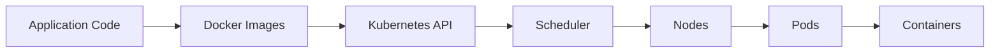

# ☸️ Kubernetes Orchestration Guide - Complete Implementation

## 🎯 **Understanding Kubernetes & Container Orchestration**

### **What is Kubernetes?**
Kubernetes (K8s) is an **open-source container orchestration platform** that automates the deployment, scaling, and management of containerized applications. It groups containers into logical units for easy management and discovery.

### **How Kubernetes Works**


**Core Concepts:**
- **🏗️ Nodes**: Physical or virtual machines running containers
- **📦 Pods**: Smallest deployable units (1+ containers)
- **🚀 Deployments**: Manage pod replicas and updates
- **🌐 Services**: Network endpoints for pods
- **⚙️ ConfigMaps**: Configuration data
- **🔐 Secrets**: Sensitive data

### **Why Kubernetes Helps Your Calculator Project**

#### **🚀 Deployment Benefits**
- **🔄 Automated Rollouts** - Zero-downtime updates
- **📊 Load Balancing** - Distributes traffic across pods
- **🔧 Self-Healing** - Restarts failed containers automatically
- **📈 Auto-Scaling** - Scales based on CPU/memory usage

#### **⚙️ Management Benefits**
- **🎯 Declarative** - Define desired state in YAML
- **🔍 Observability** - Built-in monitoring and logging
- **🔒 Security** - Pod security policies and RBAC
- **📋 Resource Management** - CPU/memory limits and requests

#### **🏗️ Architecture Benefits**
- **🏭 Microservices Ready** - Each service as separate deployment
- **🌍 Multi-Environment** - Same manifests across dev/staging/prod
- **🔧 DevOps Integration** - Works with CI/CD and GitOps tools
- **📊 Service Discovery** - Automatic pod networking

---

## 📁 **Kubernetes File Organization**

### **Project Structure**
```
/Users/parasana/Downloads/CascadeProjects/windsurf-project/
├── k8s/                           # ☸️ Kubernetes Manifests
│   ├── deployment.yaml           # 🚀 Application deployment
│   └── service.yaml              # 🌐 Service configuration
├── docker/                       # 🐳 Container images
├── argocd/                       # 🔄 GitOps configuration
├── .github/                      # 🔧 CI/CD pipeline
└── [application files...]
```

---

## 🚀 **Deployment Manifest Deep Dive**

### **What Each Section Does**

#### **📋 Deployment Configuration (`k8s/deployment.yaml`)**
```yaml
apiVersion: apps/v1
kind: Deployment                    # 🎯 Kubernetes resource type
metadata:
  name: simple-calculator           # 🏷️ Resource name
  labels:
    app: simple-calculator          # 🏷️ Labels for selection
spec:
  replicas: 2                       # 🔄 Number of pod replicas
  selector:
    matchLabels:
      app: simple-calculator        # 🎯 Which pods to manage
  template:                         # 📦 Pod template
    metadata:
      labels:
        app: simple-calculator      # 🏷️ Pod labels
    spec:
      containers:
      - name: calculator            # 🐳 Container name
        image: simple-calculator:latest  # 🖼️ Docker image
        ports:
        - containerPort: 3000       # 🚪 Container port
        livenessProbe:              # 💚 Health check
          httpGet:
            path: /
            port: 3000
          initialDelaySeconds: 10
        readinessProbe:             # ✅ Readiness check
          httpGet:
            path: /
            port: 3000
          initialDelaySeconds: 5
        resources:                  # 📊 Resource limits
          requests:
            memory: "64Mi"
            cpu: "100m"
          limits:
            memory: "128Mi"
            cpu: "200m"
```

#### **🌐 Service Configuration (`k8s/service.yaml`)**
```yaml
apiVersion: v1
kind: Service                       # 🌐 Network service
metadata:
  name: simple-calculator-service   # 🏷️ Service name
  labels:
    app: simple-calculator          # 🏷️ Service labels
spec:
  type: LoadBalancer                # 🔄 Load balancer type
  ports:
  - port: 80                        # 🌐 Service port
    targetPort: 3000                # 🎯 Container port
    protocol: TCP                   # 🔗 Protocol
    name: http                      # 🏷️ Port name
  selector:
    app: simple-calculator          # 🎯 Target pods
```

### **Resource Types Explained**

| Resource | Purpose | Key Features |
|----------|---------|--------------|
| **Deployment** | Manages pod lifecycle | Rolling updates, scaling, self-healing |
| **Service** | Network abstraction | Load balancing, service discovery |
| **Pod** | Container wrapper | Shared storage, networking |
| **ConfigMap** | Configuration data | Key-value pairs, mounted as files |
| **Secret** | Sensitive data | Encrypted, mounted as files |

---

## 🎼 **Service Types & Load Balancing**

### **Service Type Comparison**

| Type | Use Case | Access Method | Load Balancing |
|------|----------|---------------|----------------|
| **ClusterIP** | Internal communication | Within cluster only | Yes (internal) |
| **NodePort** | External access | `nodeIP:nodePort` | Yes (external) |
| **LoadBalancer** | Production external | Cloud load balancer | Yes (cloud) |
| **ExternalName** | External service alias | DNS name | No |

### **Your LoadBalancer Configuration**
```yaml
spec:
  type: LoadBalancer              # ☁️ Cloud/external load balancer
  selector:
    app: simple-calculator        # 🎯 Routes to labeled pods
  ports:
  - port: 80                      # 🌐 External port
    targetPort: 3000              # 🎯 Container port
```

### **Load Balancing in Action**
```bash
# Multiple pod replicas
kubectl get pods -l app=simple-calculator
# NAME                                 READY   STATUS
# simple-calculator-abc123             1/1     Running
# simple-calculator-def456             1/1     Running

# Service distributes traffic
kubectl get services simple-calculator-service
# TYPE         CLUSTER-IP      EXTERNAL-IP   PORT(S)
# LoadBalancer 10.96.197.163   <pending>     80:31837/TCP

# Traffic distributed across healthy pods
curl http://10.96.197.163 → Routes to pod-abc123 or pod-def456
```

---

## 🔧 **Setup Instructions with KinD**

### **Prerequisites**
```bash
# Install KinD (Kubernetes in Docker)
curl -Lo ./kind https://kind.sigs.k8s.io/dl/v0.20.0/kind-linux-amd64
chmod +x ./kind
sudo mv ./kind /usr/local/bin/kind

# Install kubectl
curl -LO "https://dl.k8s.io/release/$(curl -L -s https://dl.k8s.io/release/stable.txt)/bin/linux/amd64/kubectl"
chmod +x kubectl
sudo mv kubectl /usr/local/bin/

# Verify installation
kind version
kubectl version --client
```

### **Quick Start with Deployment Script**
```bash
cd /Users/parasana/Downloads/CascadeProjects/windsurf-project

# One-command deployment
./deploy-to-k8s.sh

# What it does:
# ✅ Creates KinD cluster
# ✅ Builds Docker image
# ✅ Loads image into cluster
# ✅ Deploys application
# ✅ Shows access information
```

### **Manual Setup (Step by Step)**
```bash
# 1. Create KinD cluster
kind create cluster --name kind

# 2. Build and load Docker image
docker build -f docker/Dockerfile -t simple-calculator:latest .
kind load docker-image simple-calculator:latest --name kind

# 3. Deploy application
kubectl apply -f k8s/deployment.yaml
kubectl apply -f k8s/service.yaml

# 4. Wait for readiness
kubectl wait --for=condition=available --timeout=60s deployment/simple-calculator

# 5. Access application
kubectl port-forward service/simple-calculator-service 8080:80
# Visit: http://localhost:8080
```

---

## 🎯 **Integration with DevOps Stack**

### **🐳 Docker Integration**
```bash
# Kubernetes uses Docker images
kubectl get pods -l app=simple-calculator -o jsonpath='{.items[0].spec.containers[0].image}'
# Output: simple-calculator:latest

# Images built with multi-stage Dockerfile
# Loaded into cluster with kind load docker-image
```

### **🔄 Argo CD Integration**
```bash
# Argo CD manages Kubernetes resources
kubectl get applications -n argocd

# Changes to k8s/ folder trigger auto-sync
# Rolling updates without downtime
# Health monitoring and self-healing
```

### **🔧 CI/CD Integration**
```yaml
# GitHub Actions tests and deploys
- name: Deploy to Kubernetes
  run: |
    kubectl apply -f k8s/
    kubectl rollout status deployment/simple-calculator
```

---

## 🛠️ **Advanced Kubernetes Features**

### **🔄 Rolling Updates**
```bash
# Update image version
kubectl set image deployment/simple-calculator calculator=simple-calculator:v2.0

# Monitor rollout
kubectl rollout status deployment/simple-calculator

# Rollback if needed
kubectl rollout undo deployment/simple-calculator
```

### **📊 Auto-Scaling**
```bash
# Install metrics server
kubectl apply -f https://github.com/kubernetes-sigs/metrics-server/releases/latest/download/components.yaml

# Create HPA (Horizontal Pod Autoscaler)
kubectl autoscale deployment simple-calculator --cpu-percent=70 --min=2 --max=10

# Check scaling
kubectl get hpa
```

### **🔍 Monitoring & Debugging**
```bash
# View pod details
kubectl describe pod simple-calculator-abc123

# Check events
kubectl get events --sort-by=.metadata.creationTimestamp

# View logs from all pods
kubectl logs -l app=simple-calculator -f

# Execute into pod
kubectl exec -it simple-calculator-abc123 -- sh
```

---

## 📈 **Performance & Resource Management**

### **Resource Requests vs Limits**

| Resource | Request | Limit | Purpose |
|----------|---------|-------|---------|
| **CPU** | 100m (10%) | 200m (20%) | Guarantees minimum, caps maximum |
| **Memory** | 64Mi | 128Mi | Memory allocation boundaries |

### **Resource Management Benefits**

✅ **📊 Predictable Performance** - Guaranteed resources  
✅ **🔒 Fair Sharing** - Prevents resource hogging  
✅ **⚡ Efficient Scheduling** - Better pod placement  
✅ **💰 Cost Optimization** - Right-size allocations  

### **Health Checks Explained**

#### **Liveness Probe** (💚)
```yaml
livenessProbe:
  httpGet:
    path: /
    port: 3000
  initialDelaySeconds: 10    # Wait before first check
  periodSeconds: 10          # Check every 10 seconds
  timeoutSeconds: 5          # Timeout after 5 seconds
  failureThreshold: 3        # Restart after 3 failures
```
- **Purpose**: Detect and restart unhealthy pods
- **Action**: Restarts container if probe fails

#### **Readiness Probe** (✅)
```yaml
readinessProbe:
  httpGet:
    path: /
    port: 3000
  initialDelaySeconds: 5     # Wait before first check
  periodSeconds: 5           # Check every 5 seconds
  timeoutSeconds: 3          # Timeout after 3 seconds
  failureThreshold: 3        # Remove from service after 3 failures
```
- **Purpose**: Determine when pod is ready to receive traffic
- **Action**: Removes pod from load balancer if probe fails

---

## 🚨 **Troubleshooting Guide**

### **Common Issues & Solutions**

#### **🐳 Pods Not Starting**
```bash
# Check pod status
kubectl get pods -l app=simple-calculator

# View pod events
kubectl describe pod <pod-name>

# Check pod logs
kubectl logs <pod-name>

# Verify image exists in cluster
docker exec -it kind-control-plane crictl images | grep simple-calculator
```

#### **🌐 Service Not Accessible**
```bash
# Check service details
kubectl get services simple-calculator-service -o wide

# Verify service selector matches pods
kubectl get pods -l app=simple-calculator --show-labels

# Test port forwarding
kubectl port-forward service/simple-calculator-service 8080:80
curl http://localhost:8080
```

#### **🔄 Deployment Issues**
```bash
# Check deployment status
kubectl get deployment simple-calculator

# View rollout history
kubectl rollout history deployment/simple-calculator

# Check replica sets
kubectl get rs -l app=simple-calculator

# View deployment events
kubectl describe deployment simple-calculator
```

#### **📊 Resource Issues**
```bash
# Check resource usage
kubectl top pods -l app=simple-calculator

# Check node resources
kubectl top nodes

# Describe resource quotas
kubectl describe resourcequota
```

---

## 📋 **Complete Workflow**

### **Development Workflow**
```bash
# 1. Make code changes
vim server.js

# 2. Test locally
node server.js

# 3. Build Docker image
docker build -f docker/Dockerfile -t simple-calculator:dev .

# 4. Load into KinD cluster
kind load docker-image simple-calculator:dev --name kind

# 5. Update deployment
kubectl set image deployment/simple-calculator calculator=simple-calculator:dev

# 6. Monitor rollout
kubectl rollout status deployment/simple-calculator

# 7. Test application
kubectl port-forward service/simple-calculator-service 8080:80
curl http://localhost:8080
```

### **Production Deployment**
```bash
# 1. Build production image
docker build -f docker/Dockerfile -t simple-calculator:latest .

# 2. Deploy to Kubernetes
kubectl apply -f k8s/

# 3. Monitor with Argo CD
kubectl port-forward svc/argocd-server -n argocd 8082:443
# Visit: https://localhost:8082

# 4. Scale as needed
kubectl scale deployment simple-calculator --replicas=5

# 5. Update with zero downtime
kubectl set image deployment/simple-calculator calculator=simple-calculator:v2.0
```

---

## 🎉 **Kubernetes Implementation Benefits Summary**

### **🔧 For Development**
- **Consistent deployment** across environments
- **Easy scaling** for load testing
- **Resource isolation** prevents conflicts
- **Development workflow** with hot reloading

### **🚀 For Deployment**
- **Automated rollouts** with zero downtime
- **Load balancing** across multiple instances
- **Self-healing** capabilities
- **Resource management** and optimization

### **☸️ For Production**
- **High availability** with multiple replicas
- **Auto-scaling** based on demand
- **Service discovery** and networking
- **Security policies** and access control

---

## 📚 **Files Purpose Summary**

| File | Purpose | Key Features |
|------|---------|--------------|
| **`deployment.yaml`** | Pod management | Replicas, updates, health checks |
| **`service.yaml`** | Network abstraction | Load balancing, service discovery |
| **`deploy-to-k8s.sh`** | Automation script | One-command deployment |

---

## 🎯 **Next Steps**

1. **📖 Study the manifests** - Understand deployment and service configuration
2. **🏗️ Try KinD setup** - Experience local Kubernetes cluster
3. **🔄 Test Argo CD integration** - See GitOps in action
4. **📊 Explore monitoring** - Set up logging and metrics

**🎉 Your calculator project demonstrates complete Kubernetes orchestration from local development to production deployment!**
